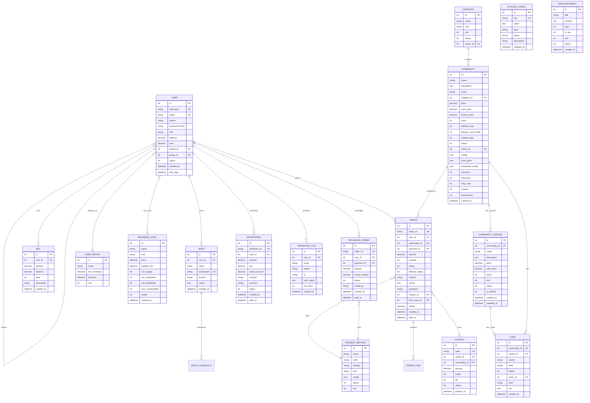
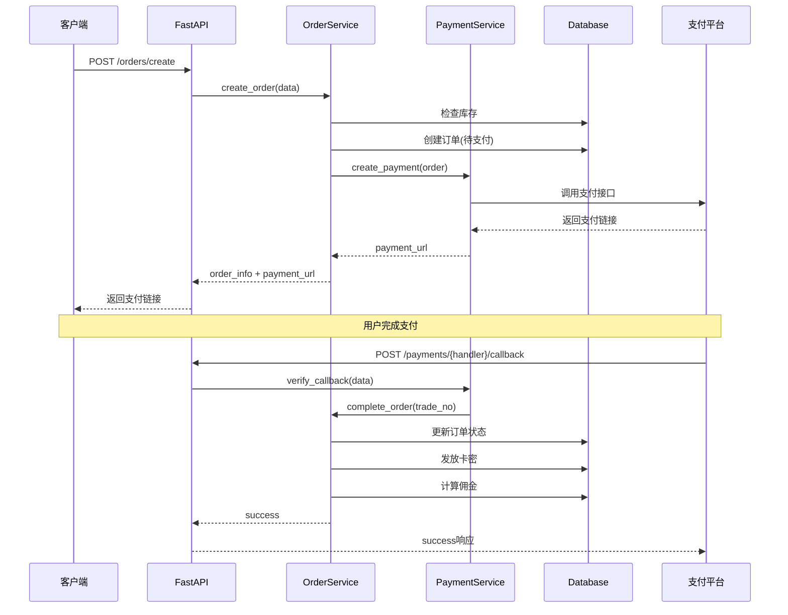
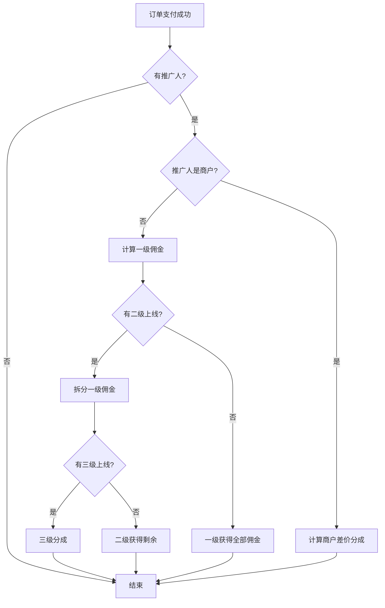
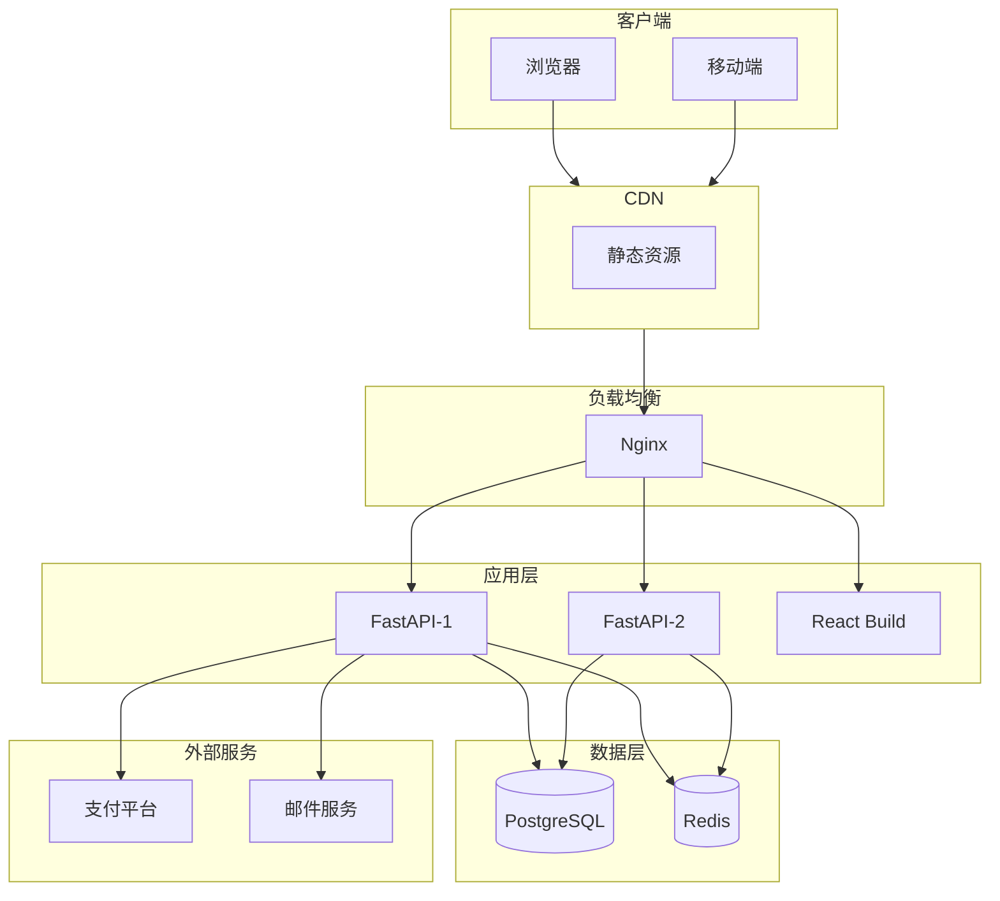

# LecFaka - 现代化发卡系统架构设计

## 一、系统概述

基于 FastAPI + React 的现代化自动发卡系统，参考 acg-faka 的核心逻辑，重新设计并实现。

### 技术栈

| 层次 | 技术选型 | 说明 |
|------|---------|------|
| 后端框架 | FastAPI | 高性能异步Python框架 |
| 数据库 | PostgreSQL / MySQL | 主数据库 |
| 缓存 | Redis | 会话、缓存、队列 |
| ORM | SQLAlchemy 2.0 | 异步ORM |
| 迁移 | Alembic | 数据库版本管理 |
| 认证 | JWT + OAuth2 | 无状态认证 |
| 前端框架 | React 18 + TypeScript | 现代化前端 |
| UI组件 | Ant Design 5 | 企业级UI |
| 状态管理 | Zustand | 轻量级状态管理 |
| HTTP客户端 | Axios | 请求封装 |
| 构建工具 | Vite | 快速构建 |

---

## 二、项目目录结构

```
lecfaka/
├── backend/                    # 后端代码
│   ├── alembic/               # 数据库迁移
│   │   ├── versions/
│   │   └── env.py
│   ├── app/
│   │   ├── __init__.py
│   │   ├── main.py            # FastAPI入口
│   │   ├── config.py          # 配置管理
│   │   ├── database.py        # 数据库连接
│   │   │
│   │   ├── models/            # 数据模型 (SQLAlchemy)
│   │   │   ├── __init__.py
│   │   │   ├── user.py        # 用户模型 (User, UserGroup)
│   │   │   ├── commodity.py   # 商品模型
│   │   │   ├── variant.py     # 商品规格/变体模型
│   │   │   ├── category.py    # 分类模型
│   │   │   ├── card.py        # 卡密模型
│   │   │   ├── order.py       # 订单模型
│   │   │   ├── payment.py     # 支付配置模型
│   │   │   ├── coupon.py      # 优惠券模型
│   │   │   ├── bill.py        # 账单模型
│   │   │   ├── shop.py        # 店铺/分站模型
│   │   │   ├── announcement.py # 公告模型
│   │   │   ├── business_level.py # 商户等级模型
│   │   │   ├── recharge.py    # 充值订单模型
│   │   │   ├── withdrawal.py  # 提现模型
│   │   │   └── log.py         # 操作日志模型
│   │   │
│   │   ├── schemas/           # Pydantic模式
│   │   │   ├── __init__.py
│   │   │   ├── user.py
│   │   │   ├── commodity.py
│   │   │   ├── order.py
│   │   │   ├── payment.py
│   │   │   └── common.py
│   │   │
│   │   ├── api/               # API路由
│   │   │   ├── __init__.py
│   │   │   ├── deps.py        # 依赖注入
│   │   │   ├── v1/
│   │   │   │   ├── __init__.py
│   │   │   │   ├── auth.py    # 认证接口
│   │   │   │   ├── users.py   # 用户接口
│   │   │   │   ├── shop.py    # 商城接口
│   │   │   │   ├── orders.py  # 订单接口
│   │   │   │   ├── payments.py # 支付接口
│   │   │   │   └── admin/     # 管理后台接口
│   │   │   │       ├── __init__.py
│   │   │   │       ├── dashboard.py     # 仪表盘（含图表数据）
│   │   │   │       ├── commodities.py   # 商品管理
│   │   │   │       ├── cards.py         # 卡密管理
│   │   │   │       ├── orders.py        # 订单管理
│   │   │   │       ├── users.py         # 用户管理
│   │   │   │       ├── settings.py      # 系统设置
│   │   │   │       ├── announcements.py # 公告管理
│   │   │   │       ├── user_groups.py   # 会员等级管理
│   │   │   │       ├── business_levels.py # 商户等级管理
│   │   │   │       ├── recharge.py      # 充值订单管理
│   │   │   │       ├── withdrawals.py   # 提现管理
│   │   │   │       ├── coupons.py       # 优惠券管理
│   │   │   │       ├── bills.py         # 账单管理
│   │   │   │       ├── logs.py          # 操作日志
│   │   │   │       └── upload.py        # 文件上传
│   │   │   │
│   │   │   ├── uploads.py           # 文件访问（公开）
│   │   │
│   │   ├── services/          # 业务逻辑层
│   │   │   ├── __init__.py
│   │   │   ├── auth.py        # 认证服务
│   │   │   ├── user.py        # 用户服务
│   │   │   ├── order.py       # 订单服务
│   │   │   ├── payment.py     # 支付服务
│   │   │   ├── card.py        # 卡密服务
│   │   │   ├── email.py       # 邮件服务
│   │   │   └── commission.py  # 分销佣金服务
│   │   │
│   │   ├── payments/          # 支付插件
│   │   │   ├── __init__.py
│   │   │   ├── base.py        # 支付基类
│   │   │   ├── epay.py        # 易支付
│   │   │   ├── usdt.py        # USDT支付
│   │   │   ├── alipay.py      # 支付宝(可选)
│   │   │   └── wechat.py      # 微信支付(可选)
│   │   │
│   │   ├── core/              # 核心模块
│   │   │   ├── __init__.py
│   │   │   ├── security.py    # 安全相关
│   │   │   ├── exceptions.py  # 自定义异常
│   │   │   └── events.py      # 事件钩子
│   │   │
│   │   └── utils/             # 工具函数
│   │       ├── __init__.py
│   │       ├── helpers.py
│   │       └── validators.py
│   │
│   ├── tests/                 # 测试
│   ├── requirements.txt
│   ├── alembic.ini
│   └── .env.example
│
├── frontend/                   # 前端代码
│   ├── public/
│   ├── src/
│   │   ├── main.tsx
│   │   ├── App.tsx
│   │   ├── vite-env.d.ts
│   │   │
│   │   ├── api/               # API封装
│   │   │   ├── index.ts
│   │   │   ├── auth.ts
│   │   │   ├── shop.ts
│   │   │   ├── order.ts
│   │   │   └── admin.ts
│   │   │
│   │   ├── components/        # 公共组件
│   │   │   ├── Layout/
│   │   │   ├── PaymentModal/
│   │   │   └── ...
│   │   │
│   │   ├── pages/             # 页面
│   │   │   ├── Home/          # 首页/商城
│   │   │   │   └── Product.tsx      # 商品详情（含批发价格、验证码）
│   │   │   ├── Order/         # 下单/查询
│   │   │   ├── User/          # 用户中心
│   │   │   │   ├── Layout.tsx        # 用户中心布局
│   │   │   │   ├── Dashboard.tsx     # 我的主页
│   │   │   │   ├── Shop.tsx          # 我的店铺（商户等级购买）
│   │   │   │   ├── Recharge.tsx      # 充值中心
│   │   │   │   ├── Orders.tsx        # 购买记录
│   │   │   │   ├── Coins.tsx         # 硬币兑现
│   │   │   │   ├── Referrals.tsx     # 我的下级
│   │   │   │   ├── Bills.tsx         # 我的账单
│   │   │   │   ├── Security.tsx      # 安全中心
│   │   │   │   └── Login/Register    # 登录注册
│   │   │   └── Admin/         # 管理后台
│   │   │       ├── Dashboard.tsx      # 仪表盘（公告、统计、图表）
│   │   │       ├── Users.tsx          # 会员管理
│   │   │       ├── RechargeOrders.tsx # 充值订单
│   │   │       ├── Withdrawals.tsx    # 提现管理
│   │   │       ├── UserGroups.tsx     # 会员等级
│   │   │       ├── BusinessLevels.tsx # 商户等级
│   │   │       ├── Categories.tsx     # 分类管理
│   │   │       ├── Commodities.tsx    # 商品管理
│   │   │       ├── Cards.tsx          # 卡密管理
│   │   │       ├── Coupons.tsx        # 优惠券管理
│   │   │       ├── Orders.tsx         # 商品订单
│   │   │       ├── Bills.tsx          # 账单管理
│   │   │       ├── Logs.tsx           # 操作日志
│   │   │       └── Settings.tsx       # 网站设置
│   │   │
│   │   ├── store/             # 状态管理
│   │   │   ├── index.ts
│   │   │   ├── auth.ts
│   │   │   └── shop.ts
│   │   │
│   │   ├── hooks/             # 自定义Hooks
│   │   ├── utils/             # 工具函数
│   │   ├── types/             # TypeScript类型
│   │   └── styles/            # 样式
│   │
│   ├── package.json
│   ├── vite.config.ts
│   ├── tsconfig.json
│   └── tailwind.config.js
│
├── docker/                     # Docker配置
│   ├── Dockerfile.backend
│   ├── Dockerfile.frontend
│   └── docker-compose.yml
│
├── docs/                       # 文档
│   ├── api.md
│   └── deployment.md
│
├── ARCHITECTURE.md            # 本文件
└── README.md
```

---

## 三、数据库设计

### ER图 (Mermaid)



### 商品规格系统说明

商品规格（CommodityVariant）表用于管理商品的不同变体，如月卡、年卡、季卡等。这种设计比使用 JSON 字段更加规范，便于统计和管理。

**设计要点：**

1. **一对多关系**：一个商品可以有多个规格，每个规格有独立的价格和库存
2. **规格与卡密关联**：卡密通过 `variant_id` 关联到特定规格
3. **兼容旧数据**：如果商品没有规格，卡密的 `variant_id` 为 NULL，使用旧的库存计算逻辑

**库存计算逻辑：**

```
如果商品有规格：
    对于自动发货商品：
        规格库存 = 该规格下 status=0（未售出）的卡密数量
    对于手动发货商品：
        规格库存 = 规格表的 stock 字段
    总库存 = 所有启用规格的库存之和

如果商品没有规格（兼容旧数据）：
    对于自动发货商品：
        库存 = commodity_id 下 variant_id 为 NULL 且 status=0 的卡密数量
    对于手动发货商品：
        库存 = 商品表的 stock 字段
```

**API 响应示例：**

```json
{
  "id": 1,
  "name": "VPN会员",
  "price": 30.00,
  "stock": 150,
  "variants": [
    {
      "id": 1,
      "name": "月卡",
      "price": 30.00,
      "stock": 50
    },
    {
      "id": 2,
      "name": "季卡",
      "price": 80.00,
      "stock": 30
    },
    {
      "id": 3,
      "name": "年卡",
      "price": 200.00,
      "stock": 70
    }
  ]
}
```

---

## 四、核心API设计

### 4.1 认证接口

| Method | Endpoint | 描述 |
|--------|----------|------|
| POST | `/api/v1/auth/register` | 用户注册 |
| POST | `/api/v1/auth/login` | 用户登录 |
| POST | `/api/v1/auth/refresh` | 刷新Token |
| POST | `/api/v1/auth/logout` | 退出登录 |
| POST | `/api/v1/auth/forgot-password` | 忘记密码 |

### 4.2 商城接口

| Method | Endpoint | 描述 |
|--------|----------|------|
| GET | `/api/v1/shop/categories` | 获取分类列表 |
| GET | `/api/v1/shop/commodities` | 获取商品列表 |
| GET | `/api/v1/shop/commodities/{id}` | 获取商品详情 |
| GET | `/api/v1/shop/commodities/{id}/cards` | 获取可预选卡密 |
| GET | `/api/v1/shop/payments` | 获取支付方式 |

### 4.3 订单接口

| Method | Endpoint | 描述 |
|--------|----------|------|
| POST | `/api/v1/orders/create` | 创建订单 |
| GET | `/api/v1/orders/{trade_no}` | 查询订单 |
| POST | `/api/v1/orders/{trade_no}/secret` | 获取卡密(需密码) |
| GET | `/api/v1/orders/query` | 按联系方式查询 |
| POST | `/api/v1/payments/{handler}/callback` | 支付回调 |

### 4.4 用户接口

| Method | Endpoint | 描述 |
|--------|----------|------|
| GET | `/api/v1/users/me` | 获取当前用户（含商户信息、推广统计） |
| PUT | `/api/v1/users/me` | 更新用户信息（头像、支付宝、微信等） |
| POST | `/api/v1/users/me/password` | 修改密码 |
| GET | `/api/v1/users/me/orders` | 我的订单（支持筛选、含卡密信息） |
| GET | `/api/v1/users/me/bills` | 我的账单 |
| GET | `/api/v1/users/me/referrals` | 我的下级列表 |
| GET | `/api/v1/users/me/invite-link` | 获取推广链接 |
| POST | `/api/v1/users/me/reset-merchant-key` | 重置商户密钥 |
| POST | `/api/v1/users/me/recharge` | 余额充值 |
| GET | `/api/v1/users/me/withdrawals` | 获取提现记录 |
| POST | `/api/v1/users/me/withdraw` | 申请提现（硬币兑现） |

### 4.5 管理接口 (Admin)

| Method | Endpoint | 描述 |
|--------|----------|------|
| GET | `/api/v1/admin/dashboard` | 仪表盘数据 |
| CRUD | `/api/v1/admin/categories` | 分类管理 |
| CRUD | `/api/v1/admin/commodities` | 商品管理 |
| CRUD | `/api/v1/admin/cards` | 卡密管理 |
| CRUD | `/api/v1/admin/orders` | 订单管理 |
| CRUD | `/api/v1/admin/users` | 用户管理 |
| CRUD | `/api/v1/admin/payments` | 支付配置 |
| CRUD | `/api/v1/admin/coupons` | 优惠券管理 |
| GET | `/api/v1/admin/bills` | 账单管理 |
| GET | `/api/v1/admin/logs` | 操作日志 |
| CRUD | `/api/v1/admin/user-groups` | 会员等级管理 |
| CRUD | `/api/v1/admin/business-levels` | 商户等级管理 |
| CRUD | `/api/v1/admin/announcements` | 公告管理 |
| CRUD | `/api/v1/admin/recharge` | 充值订单管理 |
| CRUD | `/api/v1/admin/withdrawals` | 提现管理 |
| GET/PUT | `/api/v1/admin/settings` | 系统设置 |
| POST | `/api/v1/admin/settings/init` | 初始化默认配置 |
| GET | `/api/v1/admin/settings/flat` | 获取扁平化配置 |
| POST | `/api/v1/admin/upload` | 文件上传 |
| GET | `/api/v1/uploads/{category}/{filename}` | 获取上传文件 |

---

## 五、核心业务逻辑说明

### 5.0 数据关联与计算规则

#### 5.0.1 库存计算规则

商品库存的计算遵循以下优先级规则：

1. **首先统计卡密数量**：查询该商品下所有 `status=0`（未售出）的卡密记录数
2. **如果有卡密**：库存 = 卡密数量（无论发货方式）
3. **如果没有卡密**：库存 = 商品表（commodities）的 `stock` 字段
4. **共享商品**：`shared_id` 不为空时，直接使用商品表的 `stock` 字段

**注意**：
- 自动发货和手动发货商品都可以使用卡密管理库存
- 添加/删除卡密时不需要手动更新商品库存
- 手动发货商品如果没有卡密，则使用 `stock` 字段

#### 5.0.2 商品配置参数系统

商品通过 `config` 字段存储配置参数，采用 INI 格式解析。支持注释（以 `#` 开头的行）。

##### [category] 商品种类

定义商品的不同种类及对应价格：

```ini
[category]
月卡=29
季卡=79
年卡=269
```

- 用户选择种类后，基础价格切换为对应种类价格
- 每个种类对应不同的卡密（通过 `cards.race` 字段关联）

##### [wholesale] 全局批发规则

**重要**：此规则仅在商品没有种类配置时生效。如果商品配置了 `[category]`，请使用 `[category_wholesale]`。

支持两种格式：

```ini
[wholesale]
# 固定价格模式
5=90
10=80

# 百分比折扣模式（95%表示95折）
3=95%
5=90%
```

##### [category_wholesale] 种类批发规则（核心功能）

为每个种类单独设置批发规则，**这是推荐的做法**：

```ini
[category_wholesale]
# 月卡批发 - 固定价格
月卡.3=25
月卡.5=22
月卡.10=18

# 季卡批发 - 固定价格
季卡.3=70
季卡.5=65

# 年卡批发 - 百分比折扣
年卡.3=95%
年卡.5=90%
```

**价格计算逻辑**：
1. 选择种类后，基础价格为该种类的价格
2. 只应用该种类的批发规则，**不会**使用其他种类或全局批发规则
3. 百分比折扣：`年卡.3=95%` 表示购买3件以上，每件为年卡价格的95%
4. 固定价格：`月卡.3=25` 表示购买3件以上，每件25元

**示例**：
- 年卡原价269元，购买3件：`269 × 95% × 3 = 766.65元`
- 月卡原价29元，购买5件：`22 × 5 = 110元`

##### [sku] 多规格 SKU

支持商品多规格选择，每个规格可设置加价：

```ini
[sku]
账号类型.全新账号=0
账号类型.老账号=20
地区.美国=0
地区.欧洲=10
```

- 格式为 `规格组.选项=加价金额`
- 加价金额叠加到当前单价上
- 支持多个规格组同时选择

##### 完整配置示例

```ini
[category]
月卡=29
季卡=79
年卡=269

[category_wholesale]
# 月卡批发规则
月卡.3=25
月卡.5=22
月卡.10=18
# 季卡批发规则
季卡.3=70
季卡.5=65
# 年卡批发规则（使用百分比折扣）
年卡.3=95%
年卡.5=90%

[sku]
账号类型.全新账号=0
账号类型.老账号=20
```

##### API 返回格式

```json
{
  "categories": [
    {"name": "月卡", "price": 29},
    {"name": "季卡", "price": 79},
    {"name": "年卡", "price": 269}
  ],
  "wholesale": [],
  "sku_config": [
    {"group": "账号类型", "option": "全新账号", "extra_price": 0}
  ],
  "category_wholesale": {
    "月卡": [
      {"quantity": 3, "price": 25, "type": "fixed"},
      {"quantity": 5, "price": 22, "type": "fixed"}
    ],
    "年卡": [
      {"quantity": 3, "discount_percent": 95, "type": "percent"},
      {"quantity": 5, "discount_percent": 90, "type": "percent"}
    ]
  }
}
```

#### 5.0.3 订单与商品字段关系

部分信息在订单查询时需要从商品表获取：

| 字段 | 来源 | 说明 |
|-----|------|-----|
| delivery_way | 商品表 | 发货方式（自动/手动） |
| leave_message | 商品表 | 售后留言 |
| payment_method | 支付方式表 | 通过 payment_id 关联获取 |

### 5.1 下单流程



### 5.2 三级分销逻辑



---

## 六、支付插件设计

### 6.1 支付基类

```python
from abc import ABC, abstractmethod
from dataclasses import dataclass
from typing import Optional

@dataclass
class PaymentResult:
    """支付结果"""
    success: bool
    payment_url: Optional[str] = None
    qrcode: Optional[str] = None
    error_msg: Optional[str] = None
    extra: dict = None

@dataclass 
class CallbackResult:
    """回调结果"""
    success: bool
    trade_no: str
    amount: float
    error_msg: Optional[str] = None

class PaymentBase(ABC):
    """支付插件基类"""
    
    def __init__(self, config: dict):
        self.config = config
    
    @abstractmethod
    async def create_payment(
        self, 
        trade_no: str, 
        amount: float,
        callback_url: str,
        return_url: str,
        **kwargs
    ) -> PaymentResult:
        """创建支付"""
        pass
    
    @abstractmethod
    async def verify_callback(self, data: dict) -> CallbackResult:
        """验证回调"""
        pass
    
    @abstractmethod
    def get_response(self, success: bool) -> str:
        """返回给支付平台的响应"""
        pass
```

### 6.2 易支付实现

```python
class EpayPayment(PaymentBase):
    """易支付实现"""
    
    async def create_payment(self, trade_no, amount, callback_url, return_url, **kwargs):
        params = {
            'pid': self.config['pid'],
            'type': kwargs.get('pay_type', 'alipay'),
            'out_trade_no': trade_no,
            'money': str(amount),
            'notify_url': callback_url,
            'return_url': return_url,
            'name': trade_no,
        }
        params['sign'] = self._generate_sign(params)
        params['sign_type'] = 'MD5'
        
        # 根据配置决定使用MAPI还是跳转
        if self.config.get('use_mapi'):
            return await self._mapi_request(params)
        else:
            url = f"{self.config['url']}/submit.php?" + urlencode(params)
            return PaymentResult(success=True, payment_url=url)
```

### 6.3 USDT支付实现

```python
class USDTPayment(PaymentBase):
    """USDT/TRC20 支付实现"""
    
    async def create_payment(self, trade_no, amount, callback_url, return_url, **kwargs):
        # 获取实时汇率
        rate = await self._get_usdt_rate()
        usdt_amount = round(amount / rate, 2)
        
        # 生成唯一收款地址或使用固定地址+金额尾数区分
        payment_address = self.config['wallet_address']
        
        # 可选：加入随机尾数便于订单匹配
        usdt_amount = self._add_unique_suffix(usdt_amount, trade_no)
        
        # 创建支付记录
        payment_record = await self._create_payment_record(
            trade_no=trade_no,
            usdt_amount=usdt_amount,
            address=payment_address
        )
        
        # 返回支付页面URL（显示二维码和金额）
        return PaymentResult(
            success=True,
            qrcode=payment_address,
            extra={
                'usdt_amount': usdt_amount,
                'address': payment_address,
                'expire_time': payment_record.expire_time
            }
        )
    
    async def check_payment(self, trade_no: str) -> bool:
        """检查链上交易（定时任务调用）"""
        record = await self._get_payment_record(trade_no)
        transactions = await self._query_trc20_transactions(record.address)
        
        for tx in transactions:
            if (tx['amount'] == record.usdt_amount and 
                tx['timestamp'] > record.created_at):
                return True
        return False
```

---

## 七、前端页面规划

### 7.1 商城前台

| 页面 | 路由 | 功能 |
|------|------|------|
| 首页 | `/` | 商品分类和列表 |
| 商品详情 | `/product/:id` | 商品详情、下单 |
| 订单查询 | `/query` | 按订单号/联系方式查询 |
| 支付页面 | `/pay/:tradeNo` | 显示支付二维码 |
| 登录 | `/login` | 用户登录 |
| 注册 | `/register` | 用户注册 |
| 用户中心 | `/user` | 个人信息 |
| 我的订单 | `/user/orders` | 订单历史 |
| 充值 | `/user/recharge` | 余额充值 |

### 7.2 管理后台

| 页面 | 路由 | 功能 |
|------|------|------|
| 仪表盘 | `/admin` | 数据概览、公告、图表 |
| 会员管理 | `/admin/users` | 用户列表 |
| 充值订单 | `/admin/recharge` | 充值订单管理 |
| 账单管理 | `/admin/bills` | 账单记录 |
| 会员等级 | `/admin/user-groups` | 会员等级CRUD |
| 商户等级 | `/admin/business-levels` | 商户等级CRUD |
| 提现管理 | `/admin/withdrawals` | 提现审核/打款 |
| 分类管理 | `/admin/categories` | 分类CRUD |
| 商品管理 | `/admin/commodities` | 商品CRUD |
| 卡密管理 | `/admin/cards` | 卡密导入/管理 |
| 优惠券 | `/admin/coupons` | 优惠券生成/管理 |
| 订单管理 | `/admin/orders` | 订单列表/发货 |
| 网站设置 | `/admin/settings` | 站点配置、支付方式 |
| 操作日志 | `/admin/logs` | 管理员操作日志 |

---

## 八、安全设计

### 8.1 认证授权
- JWT Token (Access + Refresh)
- 基于角色的权限控制 (RBAC)
- API限流 (Rate Limiting)

### 8.2 数据安全
- 密码 bcrypt 加密
- 敏感数据 AES 加密
- SQL注入防护 (ORM)
- XSS防护 (前端过滤)

### 8.3 支付安全
- 支付回调签名验证
- 订单金额校验
- 幂等性处理
- 防重放攻击

---

## 九、部署架构

### 开发环境端口配置

| 服务 | 端口 | 说明 |
|------|------|------|
| 前端 (Vite) | 8888 | React 开发服务器 |
| 后端 (Uvicorn) | 6666 | FastAPI 服务 |
| PostgreSQL | 5432 | 数据库 |
| Redis | 6379 | 缓存 |
| Adminer | 8080 | 数据库管理界面 |

### 生产环境架构



---

## 十、开发计划

### Phase 1: 基础架构 ✅
- [x] 项目结构搭建
- [x] 数据库模型设计
- [x] 基础API框架
- [x] 用户认证系统

### Phase 2: 核心功能 ✅
- [x] 商品分类管理
- [x] 卡密管理
- [x] 订单系统
- [x] 支付集成 (易支付)

### Phase 3: 扩展功能 ✅
- [x] USDT支付
- [x] 分销系统（基础）
- [x] 优惠券系统（生成、批量操作、导出）
- [x] 公告系统
- [x] 会员等级系统
- [x] 商户等级系统
- [x] 充值订单管理
- [x] 提现管理（审核、打款）
- [x] 账单管理
- [x] 操作日志系统
- [x] 网站设置（基本设置、短信、邮箱、其他）
- [x] 文件上传（图片、图标、背景）
- [x] 商品批量优惠价格配置
- [x] 商品会员等级专属价格
- [x] 商品多Tab编辑（发货设置、商品限制等）
- [ ] 分站系统（待开发）

### Phase 4: 前端开发 ✅
- [x] 商城前台
- [x] 管理后台
- [x] 响应式适配
- [x] 仪表盘数据展示（含图表）
- [x] 用户个人中心（我的主页、我的店铺、充值中心、购买记录、硬币兑现、我的下级、我的账单、安全中心）
- [x] 商品详情页（批发价格显示、验证码、支付方式选择）

### Phase 5: 部署优化 🚧
- [x] Docker化
- [ ] CI/CD
- [ ] 性能优化
- [ ] 安全加固

---

## 十一、与原系统对比

| 特性 | 原系统 (PHP) | 新系统 (FastAPI+React) |
|------|-------------|----------------------|
| 语言 | PHP 8.0 | Python 3.10+ / TypeScript |
| 框架 | 自定义MVC | FastAPI + React |
| ORM | Laravel Eloquent | SQLAlchemy 2.0 (async) |
| 性能 | 同步 | 异步高并发 |
| 前后端 | 耦合 | 完全分离 |
| API | 非标准 | RESTful |
| 文档 | 无 | 自动生成 (OpenAPI) |
| 类型安全 | 弱类型 | 强类型 (Pydantic + TS) |
| 部署 | 传统PHP | Docker容器化 |

---

## 十二、参考资源

- [FastAPI 官方文档](https://fastapi.tiangolo.com/)
- [SQLAlchemy 2.0](https://docs.sqlalchemy.org/)
- [React 文档](https://react.dev/)
- [Ant Design](https://ant.design/)
- [原 acg-faka 源码](./shop.leclee.us.kg/)
