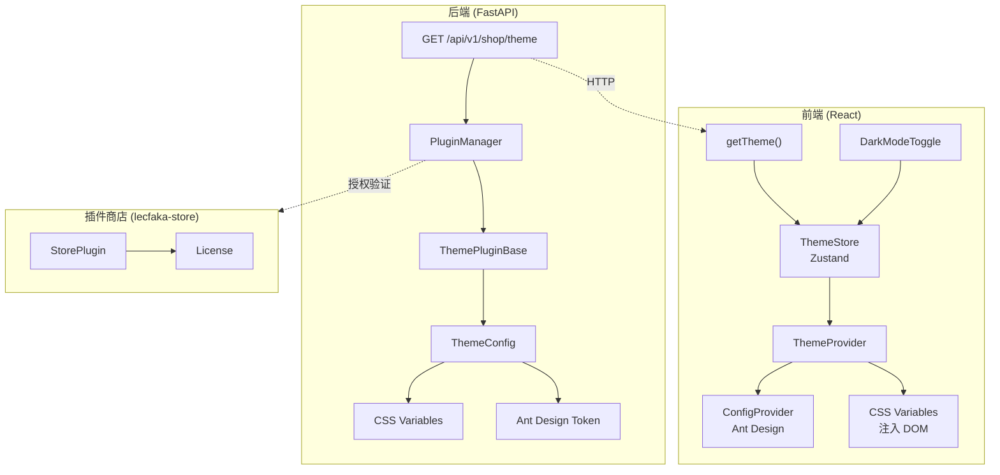
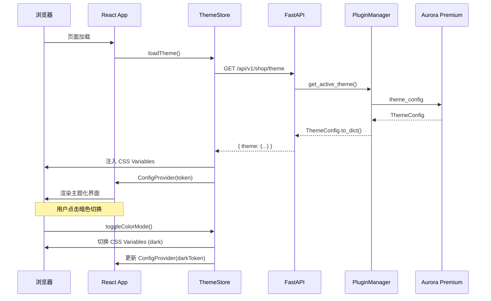

# LecFaka 主题插件系统 - 开发文档

## 📋 系统概览

LecFaka 主题插件系统允许用户通过插件商店购买和安装自定义主题，彻底改变前台商城的视觉风格。系统采用 **CSS Variables + Ant Design Token** 双轨机制，实现主题的动态加载和实时切换。

---

## 🏗 架构设计



---

## 📁 文件结构

### 后端新增/修改文件

```
backend/app/
├── plugins/
│   ├── __init__.py                    # [修改] 新增 THEME_HANDLERS、主题互斥、get_active_theme()
│   ├── sdk/
│   │   ├── __init__.py                # [修改] 导出 ThemePluginBase, ThemeConfig
│   │   └── theme_base.py             # [新增] 主题插件基类，定义完整的主题配置体系
│   └── installed/
│       └── theme_aurora_premium/      # [新增] Aurora Premium 主题插件包
│           ├── plugin.json            #   插件元数据（售价$69、需授权）
│           └── __init__.py            #   插件入口：构建完整主题配置
├── api/v1/
│   └── shop.py                        # [修改] 新增 GET /shop/theme 公开接口
```

### 前端新增/修改文件

```
frontend/src/
├── api/
│   └── shop.ts                        # [修改] 新增 ThemeData 类型 + getTheme() 接口
├── store/
│   ├── index.ts                       # [修改] 导出 useThemeStore
│   └── theme.ts                       # [新增] 主题 Zustand Store
├── components/
│   ├── ThemeProvider/index.tsx         # [新增] 主题提供者（加载+系统偏好监听+ConfigProvider）
│   └── DarkModeToggle/index.tsx       # [新增] 亮/暗模式切换按钮
├── styles/
│   └── index.css                      # [修改] 全局 CSS Variables 默认值 + 主题工具类
├── pages/Home/
│   └── index.tsx                      # [修改] 全面改造为 CSS Variables 驱动
└── App.tsx                            # [修改] 用 ThemeProvider 包裹应用
```

### 插件商店新增文件

```
lecfaka-store/app/
└── seeds/
    ├── __init__.py
    └── seed_aurora_theme.py           # [新增] Aurora Premium 上架种子脚本
```

---

## 🔧 核心组件详解

### 1. ThemeConfig (后端主题配置)

```python
@dataclass
class ThemeConfig:
    name: str                              # 主题名称
    mode: str                              # "light" | "dark" | "auto"
    colors: ThemeColors                    # 亮色模式色板（18个颜色变量）
    dark_colors: Optional[ThemeColors]     # 暗色模式色板（可选）
    typography: ThemeTypography            # 字体配置（字体栈 + Google Fonts URL）
    layout: ThemeLayout                    # 布局配置（圆角、高度、最大宽度）
    effects: ThemeEffects                  # 特效配置（阴影、毛玻璃、过渡动画）
```

**输出方法：**
| 方法 | 用途 |
|------|------|
| `to_css_variables(dark)` | 生成 32 个 CSS Variables |
| `to_antd_token(dark)` | 生成 Ant Design 5 ConfigProvider token |
| `to_dict()` | 序列化为 API 响应格式 |

### 2. 主题互斥机制 (PluginManager)

```python
# 同一时刻只允许一个主题激活
def enable_plugin(plugin_id):
    if plugin.type == "theme":
        # 自动禁用其他已激活的主题
        for handler_id in list(THEME_HANDLERS.keys()):
            if handler_id != plugin_id:
                disable_plugin(handler_id)
```

### 3. ThemeStore (前端 Zustand)

```
loadTheme() → 调用 API → 注入 CSS Variables → 加载字体 → 设置 data-theme 属性
setColorMode(mode) → 切换 CSS Variables + data-theme 属性
getAntdToken() → 返回当前模式对应的 Ant Design token
```

### 4. ThemeProvider (前端组件)

```
App 启动 → loadTheme() → ConfigProvider(token) → 子组件渲染
                       → 注入 CSS Variables
                       → 监听 prefers-color-scheme（auto 模式）
```

---

## 🎨 Aurora Premium 极光主题

### 设计特点

| 特性 | 描述 |
|------|------|
| **风格** | Liquid Glass 液态玻璃 |
| **色调** | 深色石墨 + 金色点缀 (#CA8A04) |
| **字体** | Cormorant (标题) + Montserrat (正文) |
| **模式** | 亮色 / 暗色 双模式，可跟随系统 |
| **特效** | 16px 毛玻璃、cubic-bezier 过渡、多层阴影 |

### 可配置项

| 配置项 | 类型 | 默认值 | 说明 |
|--------|------|--------|------|
| `accent_color` | color | #CA8A04 | 强调色/CTA |
| `dark_mode` | select | auto | 默认颜色模式 |
| `glass_effect` | switch | true | 毛玻璃特效 |
| `custom_font` | switch | true | 高端字体（Google Fonts） |

---

## 🔄 数据流



---

## 🚀 部署指南

### 1. 后端部署

主题插件会随 `PluginManager` 自动扫描和加载，无需额外配置。

### 2. 商品上架

```bash
cd lecfaka-store
python -m app.seeds.seed_aurora_theme
```

### 3. 用户安装流程

1. 管理员在后台「插件商店」中找到 Aurora Premium
2. 点击「安装」→ 输入授权码
3. 在「插件管理」中启用主题
4. 前台自动加载新主题

---

## 📝 开发主题插件指南

### 最小示例

```python
from app.plugins.sdk import ThemePluginBase, ThemeConfig, ThemeColors

class Plugin(ThemePluginBase):
    def get_theme_config(self) -> ThemeConfig:
        return ThemeConfig(
            name="我的主题",
            mode="light",
            colors=ThemeColors(
                primary="#1677ff",
                accent="#f5222d",
                background="#ffffff",
                surface="#fafafa",
                text_primary="#000000d9",
            ),
        )
```

### plugin.json 模板

```json
{
  "id": "theme_my_theme",
  "name": "我的主题",
  "version": "1.0.0",
  "type": "theme",
  "backend": { "entry": "__init__:Plugin" },
  "config_schema": {}
}
```
