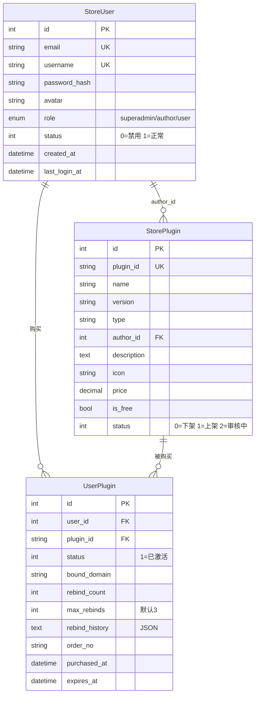

# LecFaka 插件商店 - 用户系统重构方案

## 一、核心理念

**去掉授权码，改用用户账号体系**。用户注册登录后，购买的插件直接绑定到账号，
在任何已绑定域名的发卡站实例上自动激活，无需手动输入授权码。

---

## 二、用户角色

| 角色 | 权限 |
|------|------|
| **超级管理员** (superadmin) | 全站管理、审核插件、管理用户、数据统计 |
| **插件作者** (author) | 上传/管理自己的插件、查看销售数据、提现 |
| **普通用户** (user) | 浏览商店、购买插件、管理域名绑定、查看订单 |

---

## 三、数据库模型



---

## 四、系统架构

```
┌────────────────────────────┐
│  plugins.leclee.top (Store)│  ← 独立前端 (Jinja2 模板)
│  ├─ /              首页     │
│  ├─ /plugins       商店列表 │
│  ├─ /plugin/:id    详情页   │
│  ├─ /auth/login    登录注册 │
│  ├─ /dashboard     用户中心 │
│  │   ├─ 我的插件            │
│  │   ├─ 域名管理            │
│  │   └─ 订单记录            │
│  └─ /admin         管理后台 │
│      ├─ 用户管理            │
│      ├─ 插件审核            │
│      └─ 数据统计            │
└────────────────────────────┘
         ↕ API
┌────────────────────────────┐
│  shop.leclee.top (LecFaka) │
│  后台「应用商店」页面       │
│  ├─ 浏览商店 (代理 Store API)│
│  ├─ 购买 → 跳转 Store 支付  │
│  ├─ 我的插件 → Store 账号绑定│
│  └─ 安装 → Store 验证后下载  │
└────────────────────────────┘
```

---

## 五、完整 API 设计

### A. 认证 API (`/api/v1/auth`)
| 方法 | 路径 | 说明 |
|------|------|------|
| POST | /register | 注册 |
| POST | /login | 登录，返回 JWT |
| GET  | /me | 当前用户信息 |
| PUT  | /me | 修改个人信息 |

### B. 商店 API (`/api/v1/store`)
| 方法 | 路径 | 说明 |
|------|------|------|
| GET  | /plugins | 插件列表（公开） |
| GET  | /plugins/{id} | 插件详情（公开） |
| POST | /purchase | 购买插件（需登录） |
| GET  | /my-plugins | 我购买的插件（需登录） |

### C. 域名管理 API (`/api/v1/domain`)
| 方法 | 路径 | 说明 |
|------|------|------|
| POST | /bind | 绑定域名 |
| POST | /rebind | 换绑域名 |
| GET  | /list | 我的域名列表 |

### D. 授权验证 API (`/api/v1/license`) — 给发卡站后端调用
| 方法 | 路径 | 说明 |
|------|------|------|
| POST | /verify | 验证域名是否有权使用插件 |
| POST | /check-install | 检查用户是否购买了某个插件 |

### E. 管理 API (`/api/v1/admin`) — 仅超级管理员
| 方法 | 路径 | 说明 |
|------|------|------|
| GET  | /users | 用户列表 |
| PUT  | /users/{id}/role | 修改用户角色 |
| PUT  | /plugins/{id}/status | 审核/上下架插件 |

---

## 六、页面设计

### 商店前端页面 (plugins.leclee.top)
1. **首页** — Hero 搜索 + 分类 + 精选插件
2. **插件列表** — 筛选/搜索 + 卡片展示
3. **插件详情** — 截图/描述/价格/购买按钮
4. **登录/注册** — 简洁表单
5. **用户中心** — 我的插件 + 域名管理 + 订单记录
6. **管理后台** — 用户管理 + 插件审核 + 数据统计

### shop.leclee.top 集成
- 后台「应用商店」 → 代理 Store API 展示列表
- 「购买」按钮 → 弹窗引导登录 Store 账号 → 跳转购买
- 「我的插件」 → 展示已购买+已绑定域名的插件
- 「安装」按钮 → Store 验证通过后下载安装

---

## 七、开发顺序

### Phase 1：后端基础（lecfaka-store）
1. 用户模型 + 认证 API（JWT）
2. 购买逻辑（去掉授权码，改 UserPlugin 关联）
3. 域名绑定/换绑 API
4. 验证 API（给发卡站调用）

### Phase 2：商店前端（lecfaka-store 使用 Jinja2）
5. 首页（Hero + 分类 + 精选）
6. 插件列表/详情页
7. 登录/注册页
8. 用户中心（我的插件 + 域名管理）

### Phase 3：主站集成（lecfaka）
9. 后端 license_client 改造（用域名直接验证）
10. 前端 Store.tsx 改造（展示购买状态）
11. 插件管理页显示「已购买」状态

### Phase 4：管理完善
12. 超管后台（用户管理 + 插件审核）
13. 作者后台（上传插件 + 销售统计）
